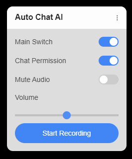

# Bilibili 直播自动聊天 AI

这是一个基于 AI 的脚本，旨在自动与 Bilibili 的主播进行互动。该项目由油猴客户端脚本组成。AI 会监听直播中的音频，使用 OpenAI 和有道的语音识别，将其转化为文本，并根据识别结果发送相关的聊天消息，与主播互动。此外，脚本还会截取直播间截图，为 AI 提供更多上下文信息。

## 功能

- **自动语音识别**：使用 OpenAI Whisper 和有道进行语音转文本。
- **自动聊天**：根据转录的音频内容自动发送聊天消息。
- **直播互动**：AI 可以模拟人类在直播间的互动。
- **油猴客户端**：用于捕获音频并自动发送聊天消息的脚本。
- **截图捕获**：捕获直播间截图，增强 AI 的应答能力。

## 示例

这是用于 Bilibili 直播的油猴脚本控制面板示例：



## 项目结构

- **客户端**：一个油猴脚本，用于与直播间互动、捕获音频和截图，并发送请求到服务器。

## 未来支持的平台

我们计划扩展平台支持到以下直播服务：

- **YouTube 直播**
- **Twitch**
- **Facebook 直播**
- **其他流行的直播平台**

这将使自动聊天 AI 能够在多个直播生态系统中广泛使用。

## 服务端代码

服务端代码当前 **暂不开放源代码**。油猴客户端脚本是开源的，可供使用和修改。未来将考虑开源服务端的实现。

如果您对客户端如何与服务器交互有疑问，欢迎提交 issue。

## 前提条件

在开始之前，请确保已安装以下内容：

- [Tampermonkey](https://www.tampermonkey.net/) 用于 Bilibili 客户端脚本。

## 油猴脚本设置

1. 在浏览器中安装 [Tampermonkey](https://www.tampermonkey.net/)。
2. 复制 `client_script.js` 文件中的油猴客户端脚本，并创建一个新的油猴脚本。
3. 将脚本中的服务器地址替换为你的服务器地址：

    ```javascript
    xhr.open('POST', 'https://your_server_address:8181/upload', true);
    ```

4. 保存并在油猴中激活脚本。

## 运行项目

1. 打开 Bilibili 直播间。油猴脚本会自动开始录制音频、捕获截图，并将其发送到服务器进行处理。

2. 服务器（当前未开源）将使用 OpenAI 和有道处理音频，生成 GPT-4 回复，并将聊天消息发送回直播间。

## 服务端命令行参数

- `--test`：启用测试模式以保存收到的文件用于调试。
- `--local`：限制服务器访问为 `127.0.0.1`（仅限本地）。
- `--check-system-tokens`：检查系统提示的 token 数量。
- `--use-whisper`：使用 OpenAI Whisper 进行语音识别。
- `--compare-speech-recognition`：对比有道和 Whisper 的语音识别结果。
- `--use-both`：同时使用有道和 Whisper 进行语音识别。

## 许可证

此项目依据 AGPL-3.0 许可证开源。有关详细信息，请参见 [LICENSE](LICENSE) 文件。

## 英文版 README

点击 [此处](README.md) 查看英文版 README。

## 贡献

欢迎贡献！如有改进建议或 bug 修复，欢迎提交 issue 或 pull request。

## 支持

如有任何问题或需要帮助，请在 [GitHub 仓库](https://github.com/bOOOOcG/StreamAssist_AI) 中提交 issue。
